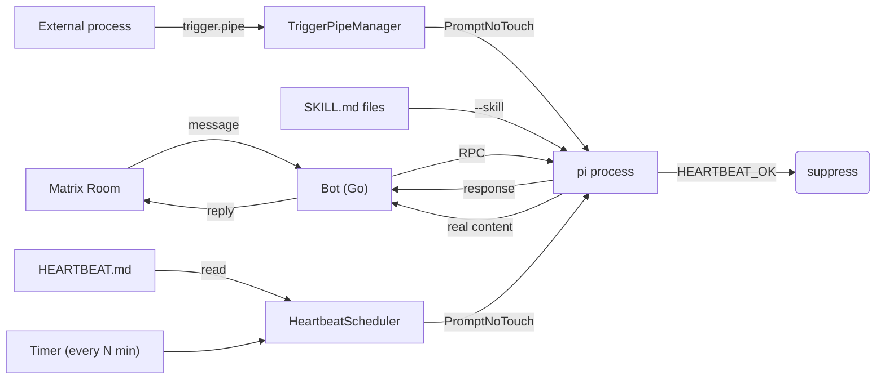

# OpenCrow

A saner alternative to [OpenClaw](https://github.com/openclaw/openclaw).
<p align="center">
  
</p>

OpenCrow is a Matrix bot that bridges chat messages to
[pi](https://github.com/badlogic/pi-mono), a coding agent with built-in tools,
session persistence, auto-compaction, and multi-provider LLM support. Instead of
reimplementing all of that in Go, OpenCrow spawns pi as a long-lived subprocess
via its RPC protocol and acts as a thin bridge. The bot operates in a single
Matrix room at a time; session data persists across room changes.



The Go bot receives Matrix messages, forwards them to the pi process, collects
the response, and sends it back.

## Bot commands

Send these as plain text messages in any room with the bot:

| Command | Description |
|---|---|
| `!restart` | Kill the current pi process and start fresh on the next message |
| `!skills` | List the skills loaded for this bot instance |
| `!verify` | Set up cross-signing so the bot's device shows as verified |

## File handling

**Receiving files** -- Users can send images, audio, video, and documents to the
bot. Attachments are downloaded to the room's session directory under
`attachments/` and the file path is passed to pi so it can read or process the
file with its tools.

**Sending files back** -- Pi can send files to the user by including
`<sendfile>/absolute/path</sendfile>` tags in its response. The bot strips the
tags, uploads each referenced file to Matrix, and delivers them as attachments.
Multiple `<sendfile>` tags can appear in a single response. The default system
prompt (and `SOUL.md`) includes instructions so pi knows about this convention.

## No safety guarantees

There is no whitelisting, permission system, or tool filtering. Trying to bolt
that onto LLM tool use is inherently futile -- the model will find a way around
it. The only real protection is running OpenCrow in a containerized or sandboxed
environment. If you try this out, **do so in a NixOS container, VM, or similar
isolation**. The included NixOS module does exactly that. Don't
run it on a machine where you'd mind the LLM running arbitrary commands.

## Authentication

Pi needs credentials for your LLM provider. There are two ways to set this up:

**Option A: Environment variable** -- set `ANTHROPIC_API_KEY` (or the
equivalent for your provider) in an environment file and pass it via the
`environmentFile` option in the NixOS module.

**Option B: OAuth (Claude Pro/Max)** -- pi supports OAuth against your Anthropic
account, so you can use your subscription instead of API credits. The initial
login is interactive and needs a browser, but subsequent token refreshes happen
automatically.

To set it up, run pi once interactively and complete the OAuth flow:

```
sudo  nixos-container root-login opencrow
PI_CODING_AGENT_DIR=/var/lib/opencrow/pi-agent pi
# Then run /login in pi and complete OAuth
```

The refresh token persists across restarts -- you only need to do this once
(unless the token gets revoked).

## Skills

Pi supports skills -- markdown files that extend the agent's capabilities by
providing instructions and examples for specific tasks. Each skill is a directory
containing a `SKILL.md` file with a YAML frontmatter (`name`, `description`) and
the skill's instructions.

OpenCrow ships with a `web` skill (for browsing with curl/lynx) and passes it to
pi by default. To configure which skills are loaded, set `OPENCROW_PI_SKILLS` to
a comma-separated list of skill directory paths:

```
OPENCROW_PI_SKILLS=/var/lib/opencrow/skills/web,/path/to/custom-skill
```

Each path should point to a directory containing a `SKILL.md` file. These are
passed to pi via `--skill` flags.

To write your own skill, create a directory with a `SKILL.md`:

```markdown
---
name: My Skill
description: What this skill does
---

Instructions for the agent on how to use this skill...
```

When using the NixOS module, the default skill path points to the packaged
`web` skill at `${cfg.package}/share/opencrow/skills/web`. Set
`OPENCROW_PI_SKILLS` in the `environment` option to override or add more.

## Heartbeat

OpenCrow can periodically wake up and check `HEARTBEAT.md` in the session
directory, prompting the AI proactively if something needs attention. This is
disabled by default.

Set `OPENCROW_HEARTBEAT_INTERVAL` to a Go duration (e.g. `30m`, `1h`) to enable
it. Every minute the scheduler checks whether the heartbeat interval has elapsed
and reads `<session-dir>/HEARTBEAT.md`. If the file is missing or contains only
empty headers and list items, the heartbeat is skipped (no API call). Otherwise
the file contents are sent to pi with a prompt asking it to follow any tasks
listed there. If pi responds with `HEARTBEAT_OK`, the response is suppressed.
Anything else is delivered to the Matrix room.

Heartbeat prompts do not reset the idle timer -- if no real user messages arrive,
the pi process is still reaped after the idle timeout.

### Trigger pipes

External processes (cron jobs, mail watchers, webhooks) can wake the bot
immediately by writing to the session directory's named pipe (FIFO):

```
<session-dir>/trigger.pipe
```

The `trigger.pipe` is created automatically when the session directory
is set up. A dedicated goroutine reads from the pipe and delivers the content
to pi immediately — no waiting for the heartbeat tick.

Example:

```
echo "New email from alice@example.com" > /var/lib/opencrow/sessions/trigger.pipe
```

Each line written to the pipe is processed as a separate trigger.

### Configuration

| Variable | Default | Description |
|---|---|---|
| `OPENCROW_HEARTBEAT_INTERVAL` | _(empty, disabled)_ | How often to run heartbeats (Go duration) |
| `OPENCROW_HEARTBEAT_PROMPT` | built-in | Custom prompt sent with the HEARTBEAT.md contents |
